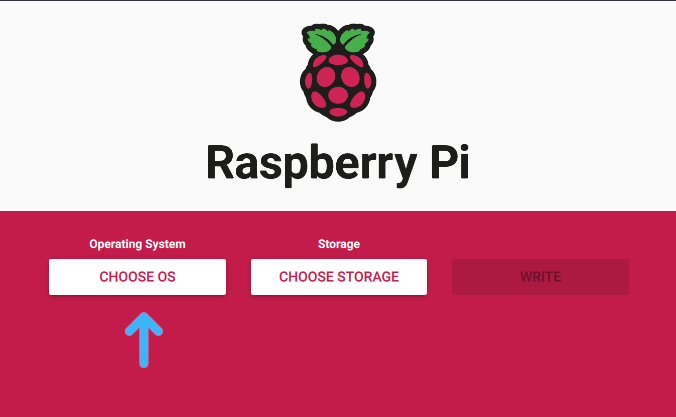
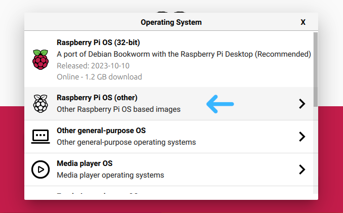
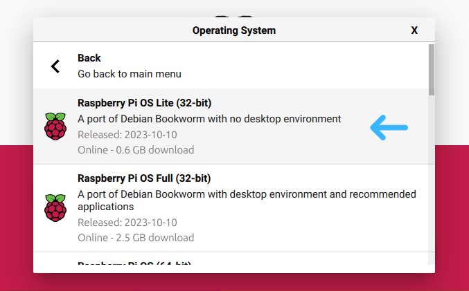
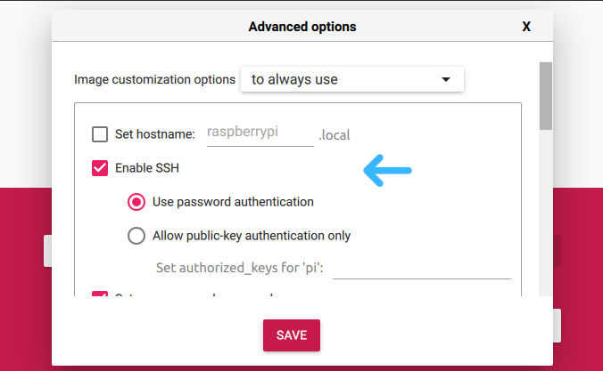
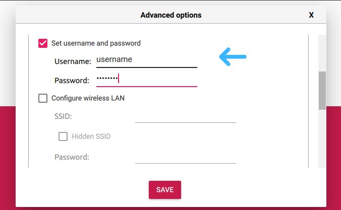
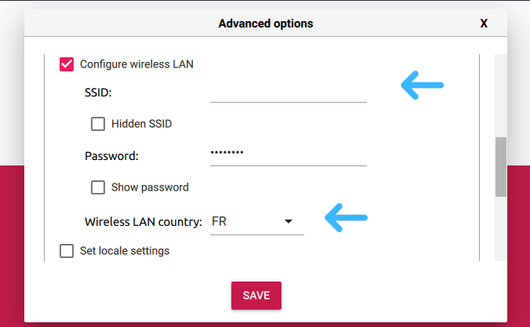
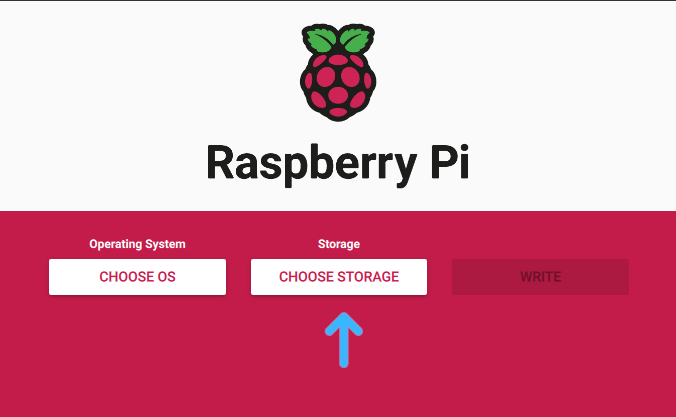

# Introduction

## Feature List

- [ ] Read EPUBs
- [ ] Read PDFs
- [ ] Buttons change pages
- [ ] Connect to book servers


## Implemented

- [x] Write a .gitignore
- [x] Setup the board

  
## Wip

- [ ] Write or use an ePub parser

  
## Iced


# Environment definition

## Component list

### Hardware

| Component list                  | Documentation                                                                                                                                                                              |
|---------------------------------|--------------------------------------------------------------------------------------------------------------------------------------------------------------------------------------------|
| Raspberry pi Zero W v1.1        | [Pinout](https://cdn.sparkfun.com/assets/learn_tutorials/6/7/6/PiZero_1.pdf), [detailed schematics](https://datasheets.raspberrypi.com/rpizero/raspberry-pi-zero-w-reduced-schematics.pdf) |
| WaveShare 7.5in E-Paper HAT     | [Doc](https://www.waveshare.com/wiki/7.5inch_e-Paper_HAT_Manual#Working_With_Raspberry_Pi), [schematics](https://files.waveshare.com/upload/8/87/E-Paper-Driver-HAT-Schematic.pdf)         |
| WaveShare 7.5in E-Paper display | [Doc](https://www.waveshare.com/wiki/7.5inch_e-Paper_HAT_Manual#Working_With_Raspberry_Pi)                                                                                                 |
| Micro SD card                   |                                                                                                                                                                                            |
| Micro USB cable (power)                   |                                                                                                                                                                                            |
| Micro HDMI and micro USB cables (optional)  |                                                                                                                                                                                            |


### Software

- [Raspberry Pi's GNU/Linux LITE distribution](https://www.raspberrypi.com/software/operating-systems/).
- [MuPDF](https://mupdf.readthedocs.io/en/latest/quick-start-guide.html#).

    
## Build materials

In addition to acquiring the hardware and software components, you're going to need the following materials:
- Soldering Iron
- Male Header pins
- Micro USB and micro HDMI cables
- Micro SD card with enough space to hold the OS and some books


# Setting up the Raspberry Pi

We start by **installing the Raspberry Pi OS** on the board, **creating a user**, **connecting to a network**, and **setting up an SSH session**.

There are 3 ways to go from here: using the Raspberry Pi software, setting up manually, and setting up headless.

> Warning: during the setup, the power supply should always be connected last.


## Raspberry Pi Imager

1. Download the [Raspberry Pi Imager](https://www.raspberrypi.com/software/).
2. Plug in the micro SD card and start the Imager.
3. Select an OS: we chose the Raspberry Pi OS Lite.  
     
4. Pre-configure the OS: press `Ctrl-Shift-X` or click on the settings icon.  
   Enable SSH, create a user, and setup the network. Make sure you select your country's country code.
     
6. Save the configuration and exit the settings.
7. Select the micro USB in the Storage menu.  
   
8. Click "Write" and wait for the installation. Eject and remove the micro SD card.
9. Insert the micro SD card, and connect the board to a power supply with the micro USB port labeled "PWR".

The Raspberry Pi will boot and get configured automatically. After a while, you should be able to access the Pi via SSH.


## Manual setup

1. Booting
   - Download the [Raspberry Pi's OS](https://www.raspberrypi.com/software/operating-systems/) and use [Balena etcher](https://etcher.balena.io/) to install it on the SD card.
   - Insert the micro SD card, a keyboard and a display. If you cant use a monitor or keyboard, see the next section.
   - Connect the board to a power supply with the micro USB port labeled "PWR".
   - Follow the first-boot wizard instructions and create a user.

2. Configuring the network
    - Use `sudo raspi-config`, select `System Options` > `Wireless LAN`, enter your network's SSID and password.
    - Alternatively, open the `wpa_supplicant` config file: `sudo nano /etc/wpa_supplicant/wpa_supplicant.conf`. The config file needs these informations:
      ```
      ctrl_interface=DIR=/var/run/wpa_supplicant GROUP=netdev
      country=<Insert 2 letter country code here>
      update_config=1

      network={
      ssid="<Name of your wireless LAN>"
      psk="<Password for your wireless LAN>"
      }
      ```
    - Save and exit, and connect to the network: `sudo wpa_supplicant wlan0 -c /etc/wpa_supplicant/wpa_supplicant.conf`.

3. Enabling SSH: run `sshd`, and write down your IP address with `ifconfig`.


> If you can't connect to a network, you can try:
> - Waiting a few minutes: it takes a little while for the Raspberry Pi to boot up and register on the network.
> - Unplugging any over-consuming device: some back-lit keyboards and mice suck up too much power for the Raspberry Pi to work properly.
> - Verifying that you're attempting to connect to the 2.4 GHz band of your network: some Raspberry Pi boards don't support 5 GHz networks.


## Headless setup

If you cant use a monitor or keyboard, you can add the required config files to the boot partition of the SD Card:


1. Download  the [Raspberry Pi's OS](https://www.raspberrypi.com/software/operating-systems/) and use [Balena etcher](https://etcher.balena.io/) to install it on the SD card.
2. Access the boot partition from a Linux or Windows machine.
3. Create a user configuration file: run `echo "myuser:$(echo 'mypassword' | openssl passwd -6 -stdin)" > userconf`. Replace `myuser` and `mypassword`.
4. Create a `wpa_supplicant.conf` file and add the contents from the code block of step 2 in the previous section.
5. Create an empty file called `ssh`.
6. Eject the SD card, put it in the Raspberry Pi and boot it up.

> If you're using Windows, make sure it didn't suffix any of the files with `.txt`.


# Connecting via ssh

On your machine, run ~


# Configuration.

1. In the SSH session, run `sudo raspi-config`. Choose Interfacing Options -> SPI -> Yes Enable SPI interface.
2. Run `sh install=the-stuff.sh` to install the dependencies.
3. Run `git clone https://github.com/waveshare/e-Paper.git` to install the demo repo.


# Assembling hardware

1. Run `sudo poweroff` in the SSH session. Wait for the LED to be off and unplug everything.
2. Solder 40 pins to the Pi and connect it to the HAT.


# Installing software


# Loading books


